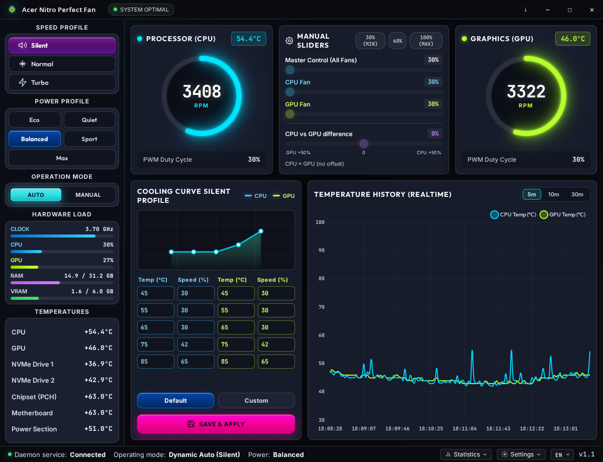

# Acer Nitro Perfect Fan

[](https://www.kernel.org/)
[](https://www.python.org/)
[](https://www.electronjs.org/)
[](LICENSE)
[](gui-app/package.json)
[](https://github.com/Kaspral1/Acer-Nitro-Perfect-Fan/actions/workflows/ci.yml)

**Acer Nitro Perfect Fan** — Linux + systemd fan control for **Acer Nitro 5**. Verified on **AN515-54**.  
systemd daemon → shared JSON → Python stdio bridge → Electron dashboard.



| Start here | |
|------------|---|
| **Never used a terminal?** | **[INSTALL.md](INSTALL.md)** (copy-paste) |
| **Po polsku** | [INSTALL_PL.md](INSTALL_PL.md) · [README_PL.md](README_PL.md) |
| Diagnose a machine | `./check-system.sh` (read-only) |

> **Safety.** Manual fan control can **overheat and damage hardware**. CPU PWM is **hard-clamped to 30%** (daemon + API + GUI). GPU may still use Zero-RPM when cool. **Use at your own risk.**

Windows and macOS are **not** supported.

---

## Features

- Cooling profiles: Silent / Balanced / Turbo with independent CPU & GPU curves
- Custom curve editor: temperature (°C) → speed (%) with live preview
- Manual PWM: master + per-fan sliders (CPU floor 30%, GPU may go to 0% in dynamic mode)
- GPU Zero-RPM hysteresis: stop below ~40°C, restart above ~48°C
- EMA smoothing: fast ramp-up, slow spin-down
- System tray, i18n (PL / EN / ES / DE / CS)
- Optional CSV telemetry + in-app summary
- Connection badge: online / offline when the Python bridge is silent

---

## Laptop compatibility

The daemon picks a backend at start (`backend` in `/etc/nitro-fan/config.json`, default `auto`):

1. **`acer_nitro_ec`** — hwmon `pwm1` / `pwm2` (preferred when the module is loaded)
2. **`nbfc`** — [nbfc-linux](https://github.com/nbfc-linux/nbfc-linux) socket, if the kernel module is missing

`auto` will **not** drive NBFC while `acer_nitro_ec` exists. That avoids two writers on the same EC.

### Verified

| Model | Status |
|-------|--------|
| **Acer Nitro 5 AN515-54** | Fully tested (development machine) |

### Same EC map as AN515-54 (needs patched `acer-nitro-ec`)

Upstream DKMS only loads on 44/46/54/56/57/58 and AN517-55. This repo can add **AN515-51, AN515-55, AN517-51, AN517-54** (`regs_an515_46` — **not** fully verified):

```bash
sudo ./acer-nitro-ec/apply.sh
./check-system.sh
```

### NBFC fallback

Any laptop with a working nbfc-linux config can use this daemon's curves. See [NBFC](#nbfc-alternative-backend).

**Not claimed:** Predator, Helios, Nitro V (different EC or WMI). Do not add them to the DMI list without a real register map.

```bash
grep -H . /sys/class/hwmon/hwmon*/name | grep acer_nitro_ec
ls -l /run/nbfc_service.socket
```

---

## Related project: keizenx/nitro-fan-control

This dashboard started as a fork of **[keizenx/nitro-fan-control](https://github.com/keizenx/nitro-fan-control)** (MIT). That app is a GUI **in front of NBFC**. This repo keeps a similar Electron UI; the daemon prefers `acer_nitro_ec` and can drive **nbfc-linux** when the kernel module is missing.

File names `nbfc_control_api.py` and `nbfc_config.json` are historical. They are this project's JSON/stdio bridge and default curves, **not** NBFC service files. The real NBFC laptop profile lives in [`nbfc/`](nbfc/).

| | **This project** | **keizenx/nitro-fan-control** |
|---|------------------|--------------------------------|
| Role | Daemon + GUI | GUI only |
| Fan backend | `acer_nitro_ec` **or** nbfc-linux (auto) | [NBFC](https://github.com/nbfc-linux/nbfc-linux) / [hirschmann/nbfc](https://github.com/hirschmann/nbfc) |
| Who writes the EC | daemon → hwmon, **or** daemon → `nbfc_service` | `nbfc_service` / `nbfc.exe` |
| OS | Linux + **systemd** only | Linux and **Windows** |
| Extra kernel module | `acer-nitro-ec` (DKMS) for the hwmon path | `ec_sys` / `acpi_ec` (`write_support=1`) |
| Curves | Interpolated °C→% editor, EMA, 30% CPU floor, GPU Zero-RPM | NBFC step thresholds; Silent/Balanced/Turbo as preset targets |
| Model coverage | patched AN515/AN517 list, plus any nbfc-linux config | Any laptop with an NBFC config (~180 models) |
| Packaged GUI | AppImage / `.deb` — **daemon still required** | AppImage / `.deb` / Windows installer |

Use this project on Linux. Use keizenx + NBFC when you need Windows.

---

## Architecture

```
┌─────────────────────────────────────────────────────────────┐
│              Electron Dashboard (GUI)                       │
│   preload.js bridge · contextIsolation · Chart.js           │
└──────────────────────────────┬──────────────────────────────┘
                               │ IPC + Python stdio JSON
┌──────────────────────────────▼──────────────────────────────┐
│              Python API (nbfc_control_api.py)               │
└──────────────────────────────┬──────────────────────────────┘
                               │ /etc/nitro-fan/config.json
┌──────────────────────────────▼──────────────────────────────┐
│         Daemon (nitro_fan_daemon.py / acer-nitro-perfect-fan)        │
│              fan_backend.py  (auto detect)                  │
└───────────────┬─────────────────────────────┬───────────────┘
                │ hwmon pwm1/pwm2             │ UNIX socket
┌───────────────▼───────────────┐   ┌─────────▼──────────────┐
│     Kernel: acer_nitro_ec     │   │  nbfc_service (EC)     │
└───────────────────────────────┘   └────────────────────────┘
```

---

## Installation

Full copy-paste walkthrough: **[INSTALL.md](INSTALL.md)**.

```bash
git clone https://github.com/Kaspral1/Acer-Nitro-Perfect-Fan.git
cd Acer-Nitro-Perfect-Fan
./check-system.sh
# need a backend first: acer_nitro_ec  or  nbfc_service
sudo ./install.sh
cd gui-app && npm install && npm start
```

`install.sh` copies the daemon to `/usr/local/lib/acer-nitro-perfect-fan/`, writes `/etc/nitro-fan/`, installs udev `99-acer-nitro-ec.rules`, and enables `acer-nitro-perfect-fan.service`.

Optional AppImage / `.deb`: `cd gui-app && npm run dist`. The packaged GUI **still needs** the system daemon.

---

## Uninstall

```bash
sudo ./uninstall.sh
```

Stops the service, restores EC auto, removes unit/files/udev/config and the service user. The clone and `node_modules` stay.

Emergency: `./restore-auto.sh` or `sudo systemctl stop acer-nitro-perfect-fan.service`.

---

## Configuration (`/etc/nitro-fan/config.json`)

```json
{
    "mode": "dynamic",
    "backend": "auto",
    "profile": "Silent",
    "auto_logging": true,
    "curves": {
        "cpu": [[45.0, 30.0], [65.0, 30.0], [72.0, 40.0], [80.0, 60.0], [88.0, 100.0]],
        "gpu": [[50.0, 30.0], [58.0, 30.0], [68.0, 35.0], [75.0, 55.0], [85.0, 100.0]]
    },
    "manual_speeds": {
        "0": 30.0,
        "1": 30.0
    }
}
```

- `backend`: `auto` (default), `acer_nitro_ec`, or `nbfc`
- `mode`: `dynamic` (curves) or `manual` (fixed PWM from `manual_speeds`)
- Fan `0` = CPU, fan `1` = GPU
- Curve points and manual speeds below **30%** are raised to 30% (GUI, API, daemon)
- `speed_offset` (optional, default `0`): permanent **CPU vs GPU** boost (`−50…+50`). **Positive** adds to CPU; **negative** adds to GPU.

---

## NBFC (alternative backend)

[NoteBook FanControl](https://github.com/nbfc-linux/nbfc-linux) talks to the Embedded Controller **directly**. The sibling GUI [keizenx/nitro-fan-control](https://github.com/keizenx/nitro-fan-control) uses that path.

This repo ships a tested **AN515-54** profile:

- [`nbfc/Acer Nitro AN515-54.json`](nbfc/Acer%20Nitro%20AN515-54.json) — laptop profile
- [`nbfc/nbfc.json`](nbfc/nbfc.json) — `SelectedConfigId` for `/etc/nbfc/nbfc.json`
- [`nbfc/README.md`](nbfc/README.md) — EC map and apply steps

**With this daemon** (curves stay here, NBFC only writes the EC):

```bash
sudo systemctl disable --now acer-nitro-perfect-fan.service
sudo ./nbfc/install-nbfc-config.sh
sudo systemctl enable --now nbfc_service
# optional: "backend": "nbfc" in /etc/nitro-fan/config.json
sudo ./install.sh
```

If `acer_nitro_ec` is also loaded, `auto` prefers hwmon. Force NBFC with `"backend": "nbfc"` only when you really want that path.

**NBFC alone** (keizenx GUI or `nbfc set`) — stop this daemon first.

| Fan | RPM read | Duty write | Manual unlock |
|-----|----------|------------|---------------|
| CPU | 19 (`0x13`) | 55 (`0x37`) | 34 (`0x22`) = 12 |
| GPU | 21 (`0x15`) | 58 (`0x3A`) | 33 (`0x21`) = 48 |
| Both | — | — | 151 (`0x97`) = 1 |

---

## Troubleshooting

1. **Fans ignore sliders** — `systemctl status acer-nitro-perfect-fan.service`, `./check-system.sh`
2. **GUI offline** — Python bridge not running; read the terminal where you ran `npm start`
3. **Stock EC auto** — `./restore-auto.sh` or reboot after stopping the service
4. **Missing charts** — `npm install` in `gui-app`
5. **Fans oscillate** — two writers. `systemctl is-active acer-nitro-perfect-fan.service nbfc_service`

More: [INSTALL.md](INSTALL.md#10-troubleshooting).

---

## Development

```bash
cd gui-app && npm test
python3 -m py_compile fan_backend.py nbfc_control_api.py nitro_fan_daemon.py nitro_log_summary.py
python3 test_fan_backend.py
```

See [CONTRIBUTING.md](CONTRIBUTING.md). CI: `.github/workflows/ci.yml`.

---

## License

MIT — [LICENSE](LICENSE).

Copyright (c) 2024 [keizenx](https://github.com/keizenx)  
Copyright (c) 2026 [Kaspral1](https://github.com/Kaspral1)

GUI lineage: [keizenx/nitro-fan-control](https://github.com/keizenx/nitro-fan-control).  
NBFC profile based on the AN515-54 EC map by Chandradeep Dey / alex-fl.

**This project stays MIT** when power-profile buttons are used. Those buttons talk to a separately installed [Div Acer Manager Max (DAMX)](https://github.com/PXDiv/Div-Acer-Manager-Max) daemon (and [Linuwu-Sense](https://github.com/PXDiv/Div-Linuwu-Sense)) over a Unix socket. DAMX is **GPL-3.0** and is **not** bundled here. The optional `acer-nitro-ec` kernel module in this repo is **GPL-2.0**. Details: [THIRD_PARTY.md](THIRD_PARTY.md).
