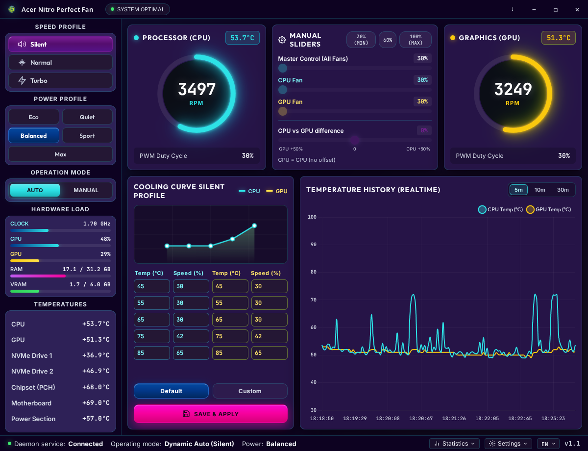
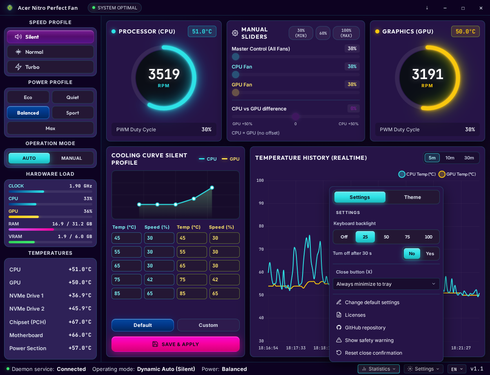

# Acer Nitro Perfect Fan <a href="https://www.buymeacoffee.com/Kaspral" target="_blank"></a>

[](https://www.kernel.org/)
[](https://www.python.org/)
[](https://www.electronjs.org/)
[](LICENSE)
[](gui-app/package.json)
[](https://github.com/Kaspral1/Acer-Nitro-Perfect-Fan/actions/workflows/ci.yml)

**Acer Nitro Perfect Fan** — sterowanie wentylatorami na **Linuxie + systemd** dla **Acer Nitro 5**.  
Zweryfikowane na **AN515-54**. Demon systemd → wspólny JSON → most Python → dashboard Electron.

Motyw **Nitro** (domyślny):


Motyw **OutRun** (Ustawienia → Motyw):



| Zacznij tutaj | |
|---------------|---|
| **Nie programuję** | **[INSTALL_PL.md](INSTALL_PL.md)** — kopiuj komendy |
| English | [INSTALL.md](INSTALL.md) · [README.md](README.md) |
| Diagnostyka | `./check-system.sh` (tylko odczyt) |

> **Ostrzeżenie.** Ręczne sterowanie może **przegrzać i uszkodzić sprzęt**. PWM **CPU ma twardą podłogę 30%** (daemon + API + GUI). GPU może nadal używać Zero-RPM na zimno. **Używasz na własną odpowiedzialność.**

Windows i macOS **nie są** obsługiwane.

---

## Funkcje

**Wentylatory** (daemon — startuje z systemem, okienko nie musi być otwarte)

- Profile: Cichy / Normalny / Turbo z osobnymi krzywymi CPU i GPU
- Edytor krzywych: temperatura (°C) → obroty (%) z podglądem
- Manualne PWM: master + osobne suwaki (CPU min. 30%, GPU w dynamic może 0%)
- Histereza Zero-RPM GPU: stop poniżej ~40°C, start powyżej ~48°C
- Wygładzanie EMA

**Profil zasilania CPU** (sidebar — Eco / Cichy / Balans / Sport / Max)

- Zmienia turbo i limity procesora przez osobno zainstalowany daemon [DAMX](https://github.com/PXDiv/Div-Acer-Manager-Max), niezależnie od krzywych wentylatorów
- Wystarczy wybrać **raz**. DAMX zapamiętuje wybór i wgrywa go przy starcie systemu — tego programu nie trzeba wtedy uruchamiać
- Bez DAMX reszta panelu działa; te pięć przycisków zostaje offline

**Podświetlanie klawiatury** (Ustawienia, **AN515-54** + `acer-nitro-ec`)

- Poziomy **Off / 25 / 50 / 75 / 100** oraz opcjonalne gaśnięcie po 30 s
- Zapis idzie wprost do Embedded Controllera. Ustawiasz raz; **zostaje po restarcie** przy zamkniętym programie
- Na zwykłym Linuksie BIOS dawał tylko wyłączenie albo timeout 30 s, a **każdy start wracał na 100%**. Ten panel to brakujące „zostaw mój poziom”



**Interfejs**

- Dwa motywy: **Nitro** (domyślny) i **OutRun** — Ustawienia → Motyw, zapamiętywane po restarcie
- Zasobnik systemowy, i18n (PL / EN / ES / DE / CS)
- Opcjonalne logi CSV + modal podsumowania
- Badge połączenia: online / offline

---

## Kompatybilność

Daemon na starcie wybiera backend (`backend` w `/etc/nitro-fan/config.json`, domyślnie `auto`):

1. **`acer_nitro_ec`** — hwmon `pwm1` / `pwm2` (gdy moduł jest załadowany)
2. **`nbfc`** — gniazdo [nbfc-linux](https://github.com/nbfc-linux/nbfc-linux), gdy nie ma sterownika

`auto` **nie** pisze przez NBFC, gdy istnieje `acer_nitro_ec` (żeby dwa programy nie walczyły o EC).

### Zweryfikowane

| Model | Status |
|-------|--------|
| **Acer Nitro 5 AN515-54** | Pełne testy (maszyna deweloperska) |

### Ta sama mapa EC co AN515-54 (wymaga spatchowanego `acer-nitro-ec`)

Upstream DKMS ładuje się tylko na 44/46/54/56/57/58 i AN517-55. Tutaj można dodać **AN515-51, AN515-55, AN517-51, AN517-54** (`regs_an515_46` — **nie** w pełni zweryfikowane):

```bash
sudo ./acer-nitro-ec/apply.sh
./check-system.sh
```

### Fallback NBFC

Laptop z działającym konfigiem nbfc-linux może używać krzywych tego daemona. Zobacz [NBFC](#nbfc-alternatywny-backend).

**Nie obiecujemy:** Predator, Helios, Nitro V (inny EC albo WMI). Nie dopisuj ich do listy DMI bez mapy rejestrów z żywego sprzętu.

---

## Pokrewny projekt: keizenx/nitro-fan-control

Dashboard powstał jako fork **[keizenx/nitro-fan-control](https://github.com/keizenx/nitro-fan-control)** (MIT). Tamta aplikacja to GUI **przed NBFC**. Tutaj interfejs Electron zostaje; daemon woli `acer_nitro_ec`, a gdy go nie ma — steruje przez **nbfc-linux**.

Nazwy `nbfc_control_api.py` i `nbfc_config.json` są historyczne. To most JSON/stdio i domyślne krzywe **tego** projektu, nie pliki usługi NBFC. Prawdziwy profil laptopa jest w [`nbfc/`](nbfc/).

| | **Ten projekt** | **keizenx/nitro-fan-control** |
|---|-----------------|--------------------------------|
| Rola | Daemon + GUI | Tylko GUI |
| Backend | `acer_nitro_ec` **albo** nbfc-linux (auto) | [NBFC](https://github.com/nbfc-linux/nbfc-linux) / [hirschmann/nbfc](https://github.com/hirschmann/nbfc) |
| Kto pisze do EC | daemon → hwmon **albo** daemon → `nbfc_service` | `nbfc_service` / `nbfc.exe` |
| System | tylko Linux + **systemd** | Linux i **Windows** |
| Moduł jądra | `acer-nitro-ec` (DKMS) na ścieżce hwmon | `ec_sys` / `acpi_ec` (`write_support=1`) |
| Krzywe | interpolowany edytor °C→%, EMA, podłoga CPU 30%, Zero-RPM GPU | progi schodkowe NBFC |
| Modele | spatchowana lista AN515/AN517 + konfigi nbfc-linux | każdy laptop z konfigiem NBFC (~180 modeli) |
| Paczka GUI | AppImage / `.deb` — **demon nadal wymagany** | AppImage / `.deb` / installer Windows |

Na Linuksie — ten projekt. Na Windowsie — keizenx + NBFC.

---

## Architektura

```
┌─────────────────────────────────────────────────────────────┐
│              Dashboard Electron (GUI)                       │
└──────────────────────────────┬──────────────────────────────┘
                               │ IPC + JSON stdio
┌──────────────────────────────▼──────────────────────────────┐
│              nbfc_control_api.py  (most, nazwa historyczna) │
└──────────────────────────────┬──────────────────────────────┘
                               │ /etc/nitro-fan/config.json
┌──────────────────────────────▼──────────────────────────────┐
│         nitro_fan_daemon.py  /  acer-nitro-perfect-fan.service       │
│              fan_backend.py  (auto: hwmon albo nbfc)        │
└───────────────┬─────────────────────────────┬───────────────┘
                │ hwmon pwm1/pwm2             │ gniazdo UNIX
┌───────────────▼───────────────┐   ┌─────────▼──────────────┐
│     Kernel: acer_nitro_ec     │   │  nbfc_service (EC)     │
└───────────────────────────────┘   └────────────────────────┘
```

---

## Instalacja

Pełna instrukcja „kopiuj i wklej”: **[INSTALL_PL.md](INSTALL_PL.md)**.

```bash
git clone https://github.com/Kaspral1/Acer-Nitro-Perfect-Fan.git
cd Acer-Nitro-Perfect-Fan
./check-system.sh
sudo ./install.sh
cd gui-app && npm install && npm start
```

`install.sh` kopiuje daemon do `/usr/local/lib/acer-nitro-perfect-fan/`, konfigurację do `/etc/nitro-fan/`, regułę udev i włącza `acer-nitro-perfect-fan.service`.

Opcjonalny AppImage / `.deb`: `cd gui-app && npm run dist`. Paczka GUI **nie zastępuje** demona.

---

## Odinstalowanie

```bash
sudo ./uninstall.sh
```

Zatrzymuje usługę, przywraca auto EC, usuwa unit/pliki/udev/config i użytkownika serwisowego. Repozytorium zostaje.

Awaryjnie: `./restore-auto.sh` albo `sudo systemctl stop acer-nitro-perfect-fan.service`.

---

## Konfiguracja (`/etc/nitro-fan/config.json`)

```json
{
    "mode": "dynamic",
    "backend": "auto",
    "profile": "Silent",
    "auto_logging": true,
    "curves": {
        "cpu": [[45.0, 30.0], [65.0, 30.0], [72.0, 40.0], [80.0, 60.0], [88.0, 100.0]],
        "gpu": [[50.0, 30.0], [58.0, 30.0], [68.0, 35.0], [75.0, 55.0], [85.0, 100.0]]
    },
    "manual_speeds": {
        "0": 30.0,
        "1": 30.0
    }
}
```

- `backend`: `auto` (domyślnie), `acer_nitro_ec` albo `nbfc`
- `mode`: `dynamic` (krzywe) albo `manual` (stałe PWM z `manual_speeds`)
- Wentylator `0` = CPU, `1` = GPU
- Wartości poniżej **30%** są podnoszone do 30% (GUI, API, daemon)
- `speed_offset` (opcjonalne, domyślnie `0`): trwały boost CPU vs GPU (`−50…+50`)

---

## NBFC (alternatywny backend)

[NoteBook FanControl](https://github.com/nbfc-linux/nbfc-linux) gada z EC **bezpośrednio**. Tak działa pokrewne GUI [keizenx/nitro-fan-control](https://github.com/keizenx/nitro-fan-control).

W repo jest przetestowany profil **AN515-54**:

- [`nbfc/Acer Nitro AN515-54.json`](nbfc/Acer%20Nitro%20AN515-54.json)
- [`nbfc/nbfc.json`](nbfc/nbfc.json)
- [`nbfc/README.md`](nbfc/README.md)

**Z daemonem tego projektu:**

```bash
sudo systemctl disable --now acer-nitro-perfect-fan.service
sudo ./nbfc/install-nbfc-config.sh
sudo systemctl enable --now nbfc_service
sudo ./install.sh
```

Gdy jest też `acer_nitro_ec`, `auto` wybiera hwmon. Wymuszenie: `"backend": "nbfc"`.

**Samo NBFC** (GUI keizenx albo `nbfc set`) — najpierw zatrzymaj tego demona.

| Wentylator | Odczyt RPM | Zapis duty | Odblokowanie manual |
|------------|------------|------------|---------------------|
| CPU | 19 (`0x13`) | 55 (`0x37`) | 34 (`0x22`) = 12 |
| GPU | 21 (`0x15`) | 58 (`0x3A`) | 33 (`0x21`) = 48 |
| Oba | — | — | 151 (`0x97`) = 1 |

---

## Rozwiązywanie problemów

1. **Wentylatory nie reagują** → `systemctl status acer-nitro-perfect-fan.service`, `./check-system.sh`
2. **GUI offline** → most Python nie działa — logi z terminala `npm start`
3. **Fabryczne auto EC** → `./restore-auto.sh`
4. **Brak wykresów** → `npm install` w `gui-app`
5. **Wentylatory skaczą** → dwa kontrolery. `systemctl is-active acer-nitro-perfect-fan.service nbfc_service`

Więcej: [INSTALL_PL.md](INSTALL_PL.md#10-gdy-coś-pójdzie-nie-tak).

---

## Development

```bash
cd gui-app && npm test
python3 -m py_compile fan_backend.py nbfc_control_api.py nitro_fan_daemon.py nitro_log_summary.py
python3 test_fan_backend.py
```

Zobacz [CONTRIBUTING.md](CONTRIBUTING.md). CI: `.github/workflows/ci.yml`.

---

## Licencja

MIT — [LICENSE](LICENSE).

Copyright (c) 2024 [keizenx](https://github.com/keizenx)  
Copyright (c) 2026 [Kaspral1](https://github.com/Kaspral1)

Rodowód GUI: [keizenx/nitro-fan-control](https://github.com/keizenx/nitro-fan-control).  
Profil NBFC na bazie mapy EC Chandradeep Dey / alex-fl (AN515-54).

**Ten projekt zostaje na MIT**, także gdy działają przyciski profili zasilania. One łączą się z osobno zainstalowanym daemonem [Div Acer Manager Max (DAMX)](https://github.com/PXDiv/Div-Acer-Manager-Max) (oraz [Linuwu-Sense](https://github.com/PXDiv/Div-Linuwu-Sense)) przez gniazdo Unix. DAMX jest na **GPL-3.0** i **nie jest** dołączony do tego repozytorium. Opcjonalny moduł jądra `acer-nitro-ec` w tym repo jest na **GPL-2.0**. Szczegóły: [THIRD_PARTY.md](THIRD_PARTY.md).
